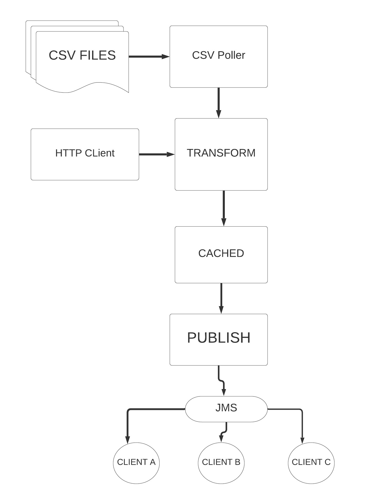
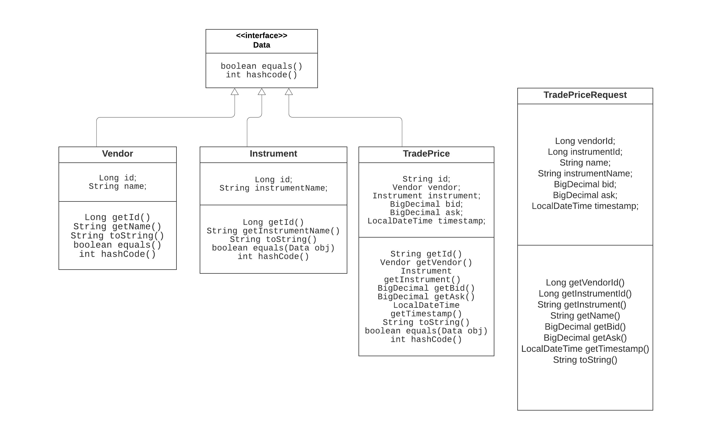
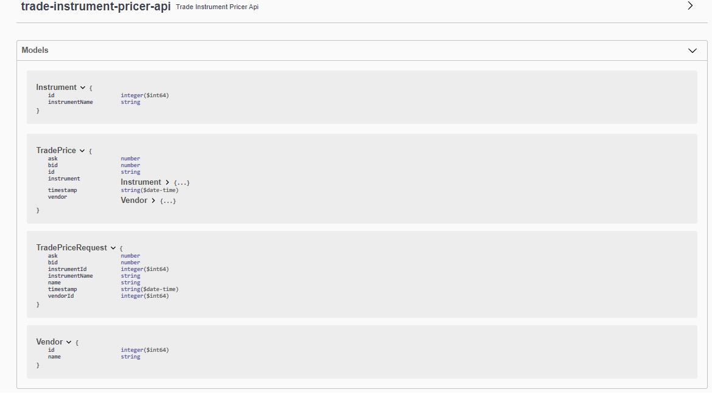
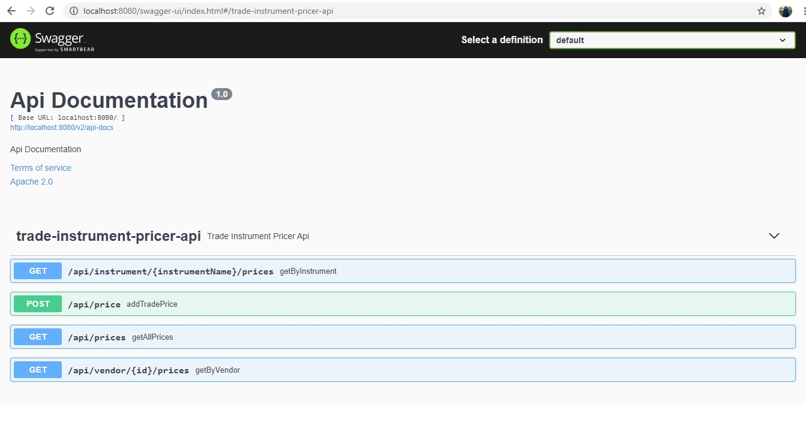
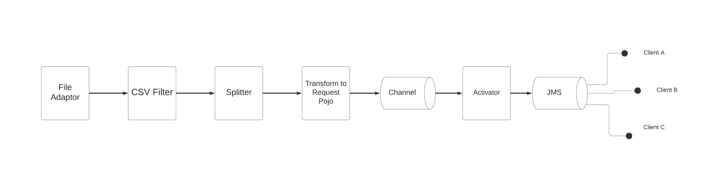

# trade-instrument-pricer
This project takes prices of instruments traded on venue. It captures the prices, caches and later persists price information provided by vendor.
# DESCRIPTION :
The project accepts prices of the traded instrument from vendors. The vendors can push the prices either from 
* the REST API endpoints or 
* by dropping the csv file in the drop Folder.
    
The drop Folder keep polling for
the files ending with *.csv. Later, it reads the file, transforms the data into equivalent Object and send the messages
to service to be cached and publishing the data to JMS Topic.

Thus, before processing the prices it will cached the data and send it to JMS topic. Incase the prices sent by vendor is
duplicated than it will override the old data with the new entries.

Cache Management will remove the old data after 30 days.

The project is built on Java 11 using maven configuration and Spring boot start up web.
The project on start up reads the default CSV file loads 4 records by default.
http://localhost:8080/api/prices loads the prices.

### High Level Desgin:



## Domain Model
The Pojo consists for 3 main classes: Vendor, Instrument and TradePrice.
TradePriceRequest is used to post the incoming http request, to further get them cached and published in JMS Topic.



### InMemory Data Store
The project uses Java in-memory maps to persist the prices coming from csv file or from rest api. 

### Cache
The solution uses Ehcache for local caching of prices. Its evicted after 30 days.
For same key, the old data is replaced with new data.

### REST End points

To get the prices -
```
* GET http://localhost:8080/api/prices
* GET http://localhost:8080/api/instrument/{instrumentName}/prices
* GET http://localhost:8080/api/vendor/{vendorId}/prices
```
To post the prices -
```
curl -H "Content-Type: application/json" --data '{"vendorId":108,"instrumentId":108,"vendorName":"ORM","instrumentName":"GOOG","bid":102.34,"ask":103.50, "timestamp":"2020-12-06T19:09:26"}' localhost:8080/api/price -v
```

* Entity Documentation - http://localhost:8080/swagger-ui/index.html#/

<br/>

* API Documentation - http://localhost:8080/swagger-ui/index.html#/TradeInstrumentPricerApi
<br/>
  



### CSV Integration Flow



